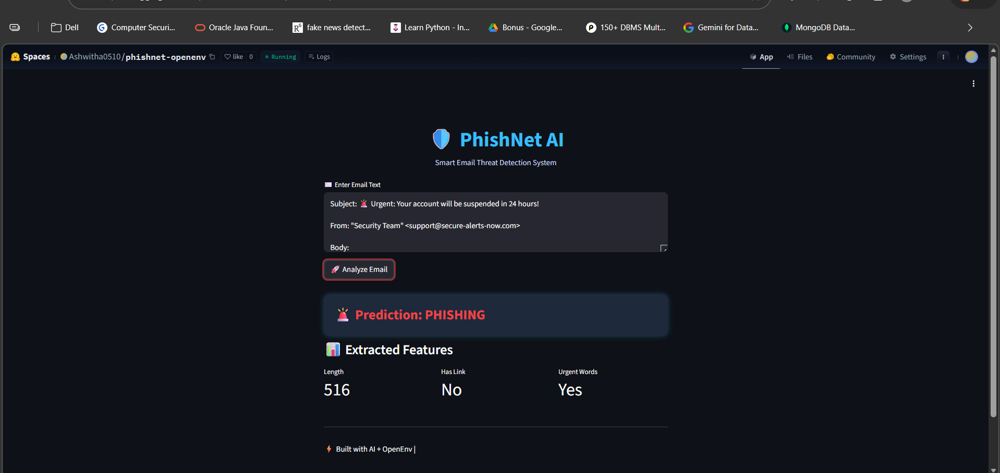

A real-world OpenEnv environment for training AI agents in cybersecurity email threat detection.
An OpenEnv-compatible environment for training and evaluating AI agents on **real-world email threat detection tasks** such as spam and phishing classification.
---
## 🧠 Overview

PhishNet simulates an intelligent email security system where an AI agent interacts with an environment to classify emails as:

* ✅ Safe
* ⚠️ Spam
* 🚨 Phishing

The environment provides structured observations, multi-step episodes, and reward-based feedback — making it ideal for training and benchmarking AI agents.

---

## 🎯 Key Features

* 🌍 **Real-world use case**: Email threat detection (cybersecurity domain)
* 🧩 **OpenEnv API**: Supports `reset()` and `step()` interactions
* 📊 **3 Difficulty Levels**:

  * Easy → obvious spam
  * Medium → basic phishing
  * Hard → realistic, tricky emails
* 🎮 **Multi-step episodes** (not a toy environment)
* 🎯 **Reward shaping** with partial credit
* 🧠 **Structured observation space** (features, not just raw text)
* 🐳 **Dockerized & deployed on Hugging Face Spaces**

---

## ⚙️ Environment Design
### 🔹 Action Space

| Action     | Description             |
| ---------- | ----------------------- |
| `safe`     | Legitimate email        |
| `spam`     | Promotional or unwanted |
| `phishing` | Malicious attempt       |

---

### 🔹 Observation Space

```python
{
  "text": str,
  "length": int,
  "has_link": bool,
  "has_urgent_words": bool
}
```

---

### 🔹 Reward Function

| Scenario                   | Reward |
| -------------------------- | ------ |
| Correct classification     | +1.0   |
| Partial (spam vs phishing) | +0.5   |
| Incorrect                  | -0.2   |

---

### 🔹 Episode Design

* Each episode contains **multiple email interactions**
* Episode ends after fixed steps (`max_steps = 5`)

---

## 🧪 Tasks & Difficulty Levels

| Level     | Description                 |
| --------- | --------------------------- |
| 🟢 Easy   | Obvious spam emails         |
| 🟡 Medium | Basic phishing attempts     |
| 🔴 Hard   | Realistic, ambiguous emails |

---

## ▶️ Running the Environment

```bash
python -m baseline.run_env
```

---

## 🌐 Live Demo

👉 **Hugging Face Space:**
(https://huggingface.co/spaces/Ashwitha0510/phishnet-openenv)

---

## 🏗️ Project Structure

```
env/        → Environment logic  
tasks/      → Task datasets (easy, medium, hard)  
grader/     → Reward & evaluation  
baseline/   → Agent execution script  
```

---

## 🧠 How It Works

1. Agent receives an email (state)
2. Agent takes action (safe/spam/phishing)
3. Environment evaluates and returns reward
4. Process repeats until episode ends

---

## 🚀 Future Improvements

* Integration with real-world datasets
* LLM-based intelligent agents
* Advanced reward shaping

---

## 🏆 Why This Project Stands Out

* ✅ Real-world cybersecurity application
* ✅ Multi-step agent interaction
* ✅ Designed for benchmarking AI systems
* ✅ Fully deployed and reproducible
---
screenshot of the demo :
 mentioned below
  